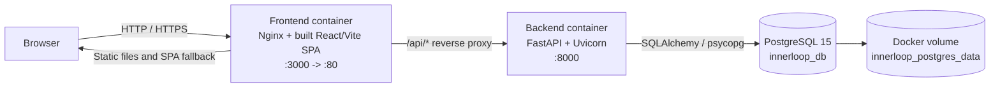
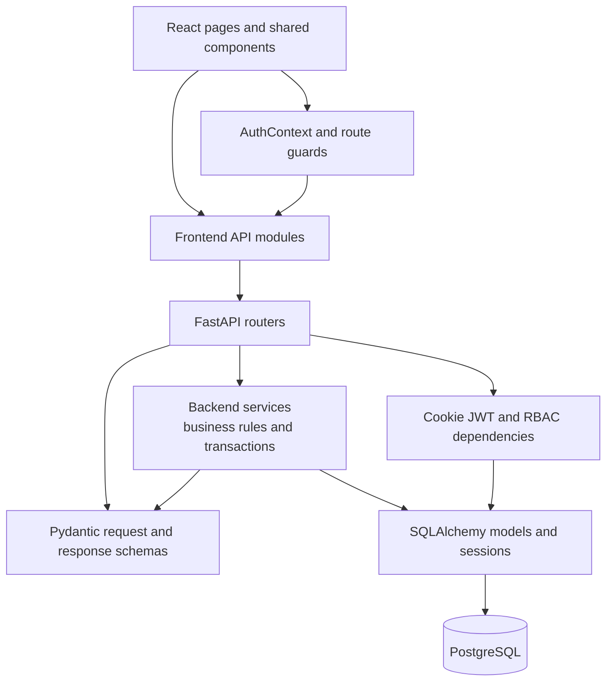
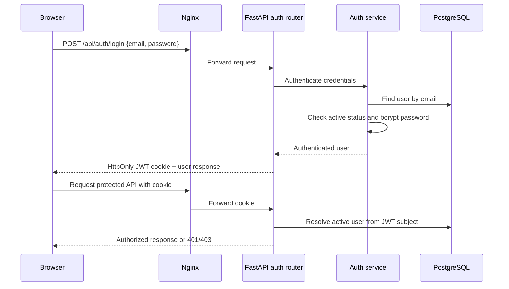
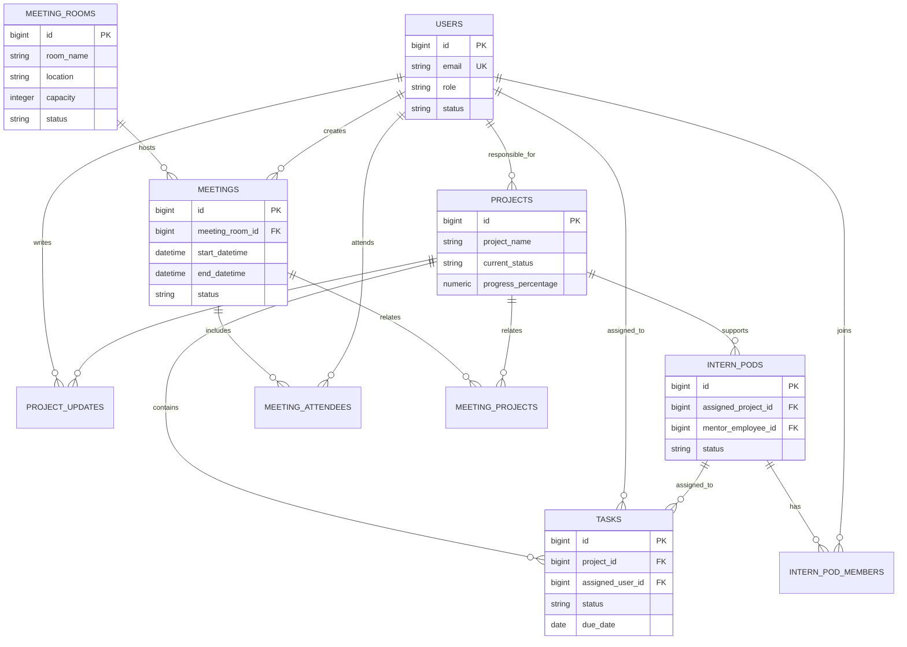

# InnerLoop System Architecture

## 1. Scope

InnerLoop is an internal Digital Lab workspace for users, projects, tasks, intern pods, meetings, meeting rooms, reports, and administration. This document describes the implementation currently present in the repository and the Docker Compose runtime used for local development.

## 2. Runtime Architecture

### Docker services

| Service | Responsibility | Container port | Host port |
|---|---|---:|---:|
| `frontend` | Builds the React application and serves it with Nginx | 80 | 3000 |
| `backend` | Runs the FastAPI HTTP API with Uvicorn | 8000 | 8000 |
| `postgres` | Stores application and audit data | 5432 | 5432 |

The frontend uses `/api` as its default API base URL. Nginx proxies that path to `http://backend:8000`, allowing browser requests and API requests to use the same origin in the Docker deployment.

## 3. Application Layers

### Frontend

- `src/main.jsx` mounts `App` inside `BrowserRouter` and `AuthProvider`.
- `src/App.jsx` owns the route tree, application shell, navigation, role-based navigation visibility, header, sidebar, and common loading/error panels.
- `src/pages/` contains dashboard, project, task, meeting, room, pod, profile, report, user, audit, settings, login, and registration screens.
- `src/api/` contains API clients. `authApi.js` provides the shared `apiRequest` helper, sends credentials with requests, and maps HTTP failures to user-facing messages.
- `ProtectedRoute` requires an authenticated user. `RoleProtectedRoute` limits employee/management and management-only route groups.

### Backend

- `app/main.py` creates the FastAPI application, configures CORS, and registers routers.
- `app/routes/` owns HTTP endpoints for authentication, dashboard, projects, tasks, meetings, intern pods, rooms, reports, users, and administration.
- `app/services/` owns business operations, database queries, authorization-aware filtering, conflict checks, and transactions.
- `app/schemas/` validates request payloads and defines response contracts.
- `app/models/` maps PostgreSQL tables to SQLAlchemy models.
- `app/utils/permissions.py` resolves the current user from the JWT cookie and provides reusable role dependencies.
- `app/database.py` creates the SQLAlchemy engine and request-scoped database sessions.

## 4. Authentication and Authorization

- Passwords are stored as bcrypt hashes, never plaintext.
- Login requires email, password, and selected role to match an active user.
- Access tokens are signed JWTs stored in an HttpOnly cookie.
- The cookie is configured through environment settings such as `AUTH_COOKIE_NAME`, `COOKIE_SECURE`, and `COOKIE_SAMESITE`.
- Backend authorization is enforced with `get_current_user` and `require_roles`; frontend guards provide navigation and user experience but are not the security boundary.
- Intern project and task visibility is additionally filtered by backend service logic using direct assignments and intern-pod relationships.

## 5. Core Data Model

Room deletion uses `ON DELETE SET NULL`: deleting a room preserves meeting history and clears `meetings.meeting_room_id`. Meeting creation and updates reject overlapping non-cancelled bookings for the same room.

## 6. Main Request Flows

### Protected workspace request

1. The browser loads the SPA from Nginx.
2. `AuthProvider` calls `/api/auth/me` with the cookie.
3. `ProtectedRoute` waits for the result and redirects unauthenticated users to `/login`.
4. A page calls its API module.
5. Nginx forwards `/api/*` to FastAPI.
6. FastAPI validates the payload, resolves the current user, applies role and data filters, and delegates business logic to a service.
7. SQLAlchemy reads or writes PostgreSQL and the router returns a typed response.

### Room deletion

1. An employee or management user sends `DELETE /api/meeting-rooms/{room_id}`.
2. The role dependency validates the authenticated user.
3. The room service deletes the room.
4. PostgreSQL sets linked meeting room references to `NULL`.
5. Meeting records remain available as historical records.

## 7. Deployment and Configuration

For Docker Compose, the backend connects to PostgreSQL using the service hostname `postgres`. The frontend is exposed at `http://localhost:3000`, the API at `http://localhost:8000`, and PostgreSQL at `localhost:5432`.

Important environment values are defined in `Backend/.env` and include:

- `DATABASE_URL`
- `JWT_SECRET`
- `JWT_ALGORITHM`
- `ACCESS_TOKEN_EXPIRE_MINUTES`
- `AUTH_COOKIE_NAME`
- `COOKIE_SECURE`
- `COOKIE_SAMESITE`
- `CORS_ORIGINS`
- `CORS_ORIGIN_REGEX`

The PostgreSQL schema is initialized from `Databases/schema.sql` only when the database volume is first created. Existing databases require explicit SQL migrations under `Backend/app/migrations/`.

## 8. Current Design Constraints and Follow-up Work

- `depends_on` controls container start order but does not wait for PostgreSQL readiness. A production deployment should add health checks and retry/backoff for the backend.
- Database migrations are SQL files but are not automatically orchestrated at application startup. A migration runner or Alembic should be introduced as the schema evolves.
- The Compose configuration is for local development. Production should use managed PostgreSQL or a separately operated database, injected secrets, TLS, restricted CORS, and `COOKIE_SECURE=true`.
- The frontend has no configured linter. The production build is the current frontend compile check.
- The backend health endpoint confirms process availability; a separate readiness check should validate database connectivity.
- Nginx serves the SPA and proxies API traffic in Docker. Direct development with Vite uses the configured API base URL and requires the backend CORS settings to permit the frontend origin.
